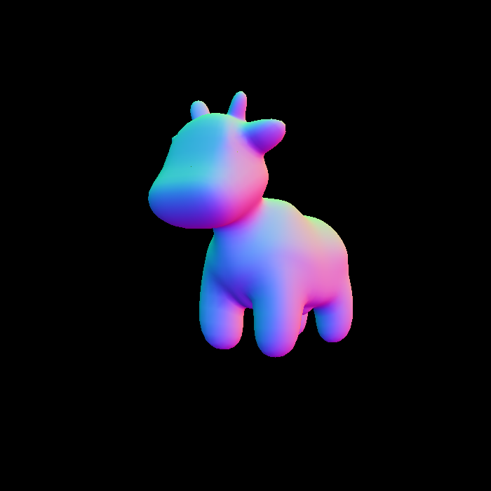
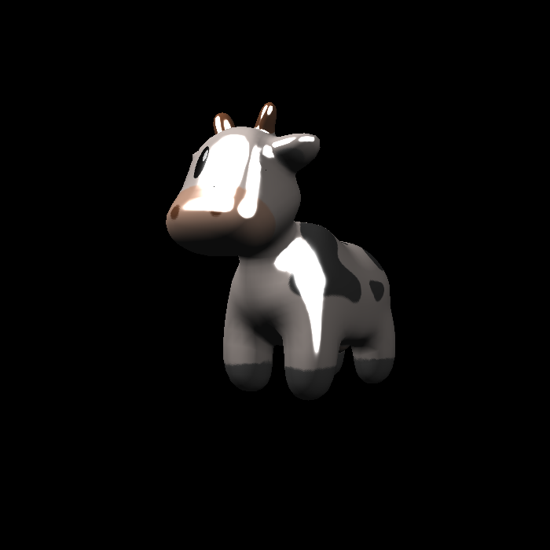
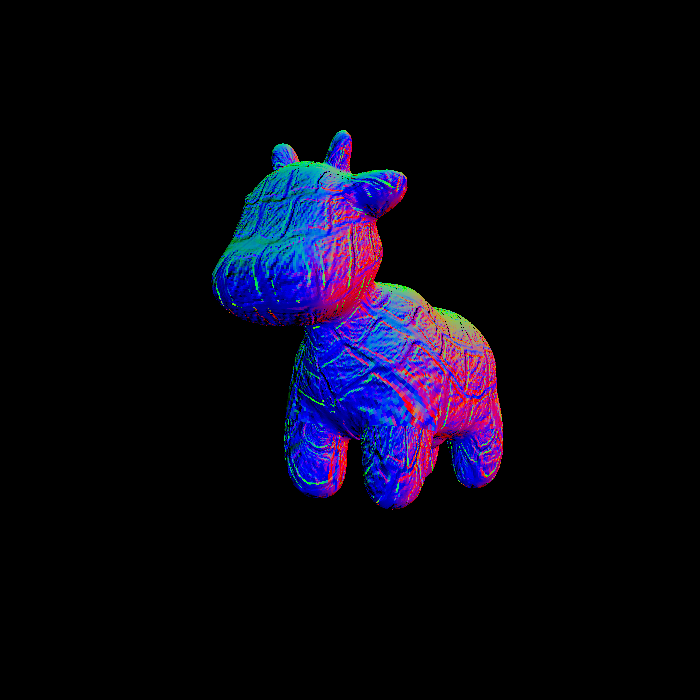
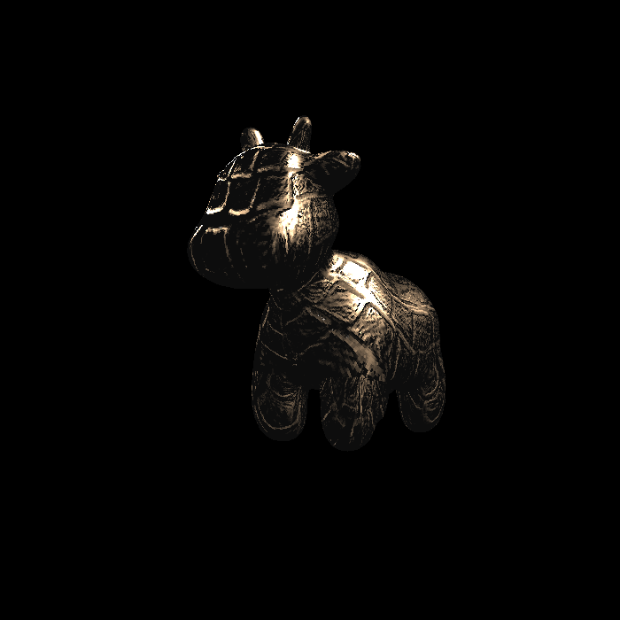

# 作业 3：光栅化与着色

## 涉及的问题

- 如何将模型顶点变换到屏幕，并判断像素是否位于三角形内部？
- 深度、法线、纹理坐标等属性怎样插值，才能处理透视变换和遮挡？
- 光照中的环境光、漫反射和镜面反射分别如何计算？
- Bump Mapping 与 Displacement Mapping 的区别是什么？

## 代码中的处理

`rasterizer.cpp` 执行屏幕三角形遍历、重心坐标插值与 z-buffer 判断。`main.cpp` 提供 normal、phong、texture、bump、displacement 五种着色器，可通过命令行和交互按键切换。凹凸映射根据高度图改变法线；位移映射在着色计算中同时改变位置和法线。

## 成果

已有源码和历史输出图片已归档；以下图片来自原项目 build 目录，不表示本次重新执行了所有着色器。源码中少量 TODO 注释仍存在，应结合函数实际实现阅读。

| 模型渲染 | 纹理 |
| --- | --- |
|  |  |

| 凹凸映射 | 位移映射 |
| --- | --- |
|  |  |

## 运行

需要 C++17、Eigen、OpenCV。当前 CMake 中有本机依赖路径，换机器时需调整。

```powershell
cmake -S . -B build
cmake --build build
cd build
.\Rasterizer.exe texture.png texture
```

模型使用 `../models` 相对路径，所以从 build 目录启动。交互模式中 A/D 旋转，1–5 切换着色器，Esc 退出。
