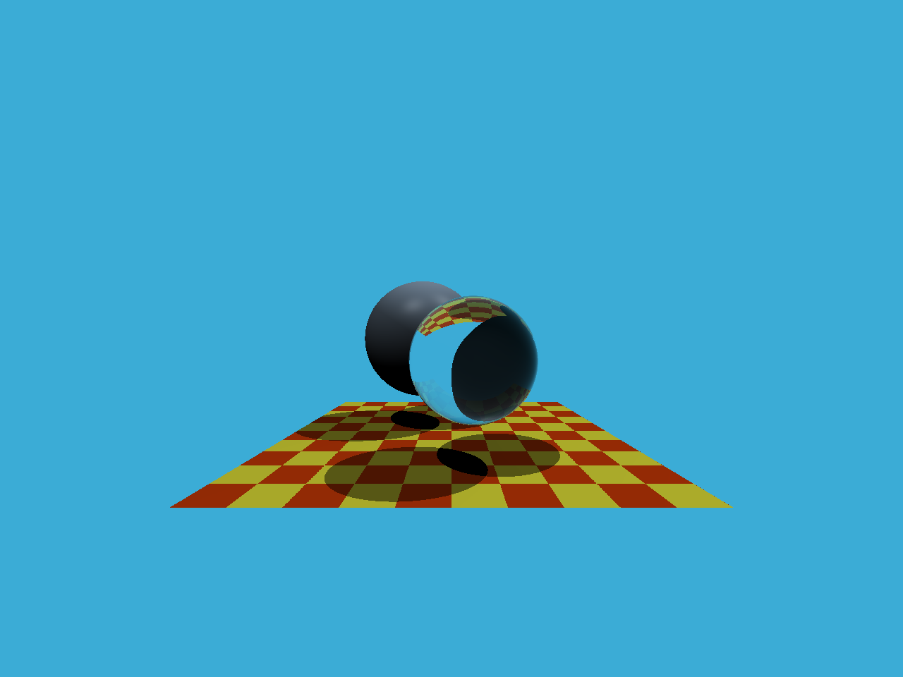

# 作业 5：Whitted 光线追踪

## 涉及的问题

- 如何根据像素坐标、相机视场角和宽高比生成主光线？
- 光线与三角形相交时，如何判断重心坐标及交点是否位于光线前方？
- 如何找到场景中最近的交点，再计算阴影、反射与折射？

## 代码中的处理

`Renderer::Render` 将像素中心映射到相机成像平面，并归一化光线方向。`rayTriangleIntersect` 使用 Möller–Trumbore 求交，检查重心坐标和交点距离。框架的 castRay 按材质进行递归反射、折射或 Phong 光照，trace 遍历物体并选取最近交点。

这一步建立了从相机光线到着色结果的基本流程；全局漫反射间接光属于作业 7 的路径追踪内容。

## 成果

原项目已有 1280×960 PPM，已转为 PNG 供 GitHub 展示。图片直接来自现有输出，本次上传未额外宣称对该作业做完整回归。



## 运行

需要支持 C++17 的编译器和 CMake，不依赖 OpenCV。

```powershell
cmake -S . -B build
cmake --build build
cd build
.\RayTracing.exe
```

输出 `binary.ppm`。
