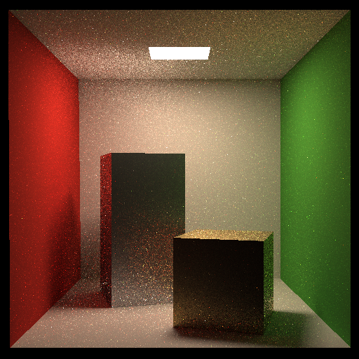
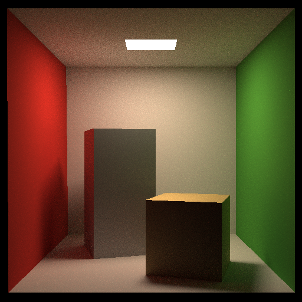

# 作业 7：路径追踪、多线程与 Microfacet

## 涉及的问题

- 如何在直接光照之外计算漫反射间接光和红绿墙面的颜色反弹？
- 光源面积采样和半球方向采样的 PDF 有什么区别？
- 如何判断表面到光源的线段是否被遮挡，并避免自相交？
- 递归如何用俄罗斯轮盘赌终止，同时补偿继续概率？
- 怎样让实际采样分布与返回的 PDF 保持一致？

## 代码中的处理

补齐三角形求交、AABB 求交和 BVH 最近交点查询。castRay 计算光源面积采样的直接项，以及均匀半球采样的间接项。阴影射线采用法线偏移和有限长度区间。存活的递归贡献除以 P_RR，避免遗漏概率权重。

修正 BVH 叶节点选择的面积分布，补齐多光源联合 PDF，并将随机数引擎改为每线程持久实例。相机可见光源返回自发光，后续反弹命中光源不重复计入基础直接光估计器。

## 成果

- Cornell Box：512×512、64 SPP，P_RR=0.8，DIFFUSE，单线程。
- 本机 Release 渲染约 67 秒，可见顶灯、箱子阴影及红绿间接反弹。
- 原路径下 Debug / Release 构建和 geometry-and-sampling 回归均通过；归入 cg 后也再次通过 Release 构建、回归和场景初始化检查。
- 已实现两个加分项：多线程 Ray Generation、GGX Microfacet 材质。
- 单 / 多线程使用相同像素种子，真实 Cornell Box 对照输出逐字节一致。
- Microfacet 展示为 512×512、256 SPP，粗糙度 0.4 / 0.7、金属度 0.85。
- 使用均匀半球采样，较光滑表面仍有采样噪声。





详细 CLion 操作、三个运行配置、公式与参数见 [加分项说明](BONUS.md)。


## 运行

```powershell
powershell -ExecutionPolicy Bypass -File .\run.ps1 -Size 512 -Spp 256 -Threads 0 -Material microfacet -Roughness 0.4
```

本机预设指向 MinGW GCC 11.2。跨平台可用普通 CMake 构建，模型路径由 CMake 指定。输出写入构建目录的 binary.ppm。

完整类说明、光照公式、调试方法与课程材料见 [学习指南](LEARNING_GUIDE.md)。

## 同参数性能验证

Release，256×256、64 SPP、DIFFUSE、种子 42：单线程 15.724 秒，20 线程 1.817 秒，本次测量约 8.65 倍；两张 PPM 完全一致。该数据只代表本机此次运行。

归入 cg 根项目后，Debug / Release 测试均通过；GDB 已实际命中 Renderer::Render 断点。完整记录见 [验证记录](images/bonus-validation.json)。
