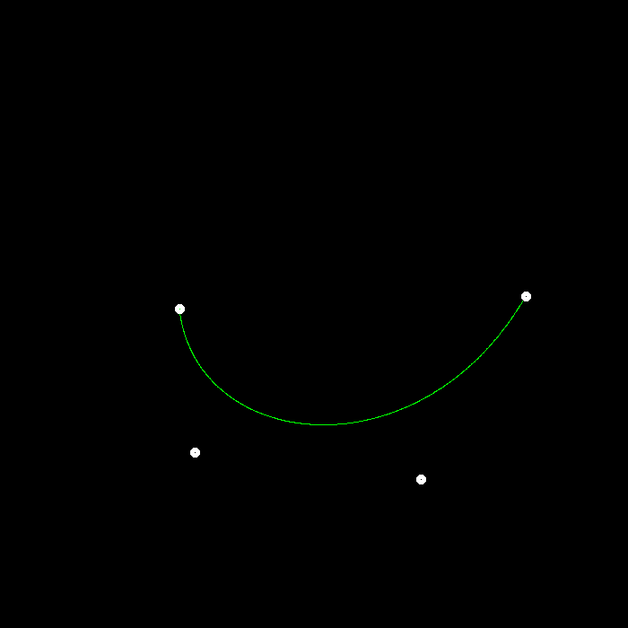
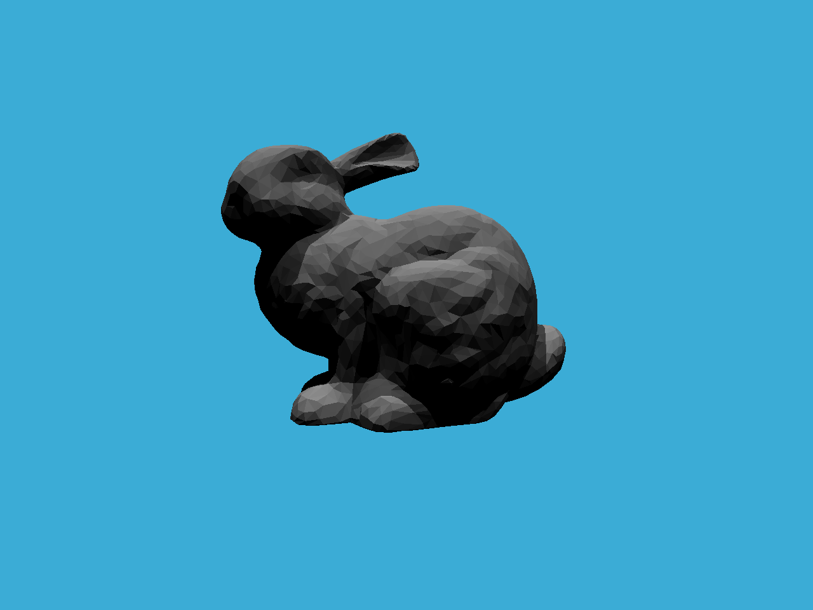
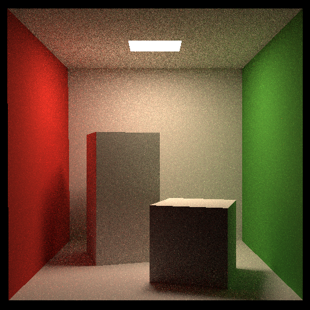

# Computer Graphics · GAMES101

记录 GAMES101 作业涉及的问题、代码中的处理方式和已有成果。每次作业的 README 都采用“问题 → 处理 → 成果 → 运行”的结构，便于复习，也便于直接查看图片。

## 作业目录

| 作业 | 主题与详细记录 | 当前状态 |
| --- | --- | --- |
| 3 | [光栅化与着色](GAMES101_Homework3_S2021/Homework3/Assignment3/README.md) | 已有实现与历史着色结果 |
| 4 | [贝塞尔曲线](GAMES101_Homework4_S2021/Assignment4/README.md) | 递归曲线及历史截图 |
| 5 | [Whitted 光线追踪](GAMES101_Homework5_S2021/Homework5/Assignment5/README.md) | 主光线、求交及历史渲染 |
| 6 | [BVH 与 SAH](GAMES101_Homework6_S2021/Homework6/Assignment6/README.md) | BVH/SAH 源码及 bunny 结果 |
| 7 | [路径追踪](GAMES101_Homework7_S2021/Assignment7/README.md) | 基础与两个加分项，CLion 配置、回归与 512×512 / 256 SPP 微表面结果 |
| 8 | [质点弹簧模拟](GAMES101_Homework8_S2021/Assignment8/README.md) | 原始框架，算法与环境待完成 |

当前归档作业 3–8。作业 1、2 与大作业不在本次 cg 目录归档范围内。

## 成果预览

| 贝塞尔曲线 | BVH bunny | Cornell Box 路径追踪 |
| --- | --- | --- |
|  |  |  |

作业 3 的多种着色结果、作业 5 的光线追踪结果也在各自 README 中展示。作业 3–6 的图片从已有本地输出归档；作业 7 的 512×512、64 SPP 结果已实际生成。原始 PPM 在需要时转换成 PNG 方便 GitHub 展示。

## 学习过程

- 作业 3：从屏幕三角形到逐像素着色，处理插值、深度和纹理。
- 作业 4：从控制点到连续曲线，将 de Casteljau 过程写成递归。
- 作业 5：从相机发射光线，用求交与材质递归生成图片。
- 作业 6：用层次包围盒减少无效求交，尝试 SAH 划分。
- 作业 7：用蒙特卡洛估计计算全局漫反射光，核对采样分布、PDF 与递归权重。
- 作业 8：接下来学习弹簧力、积分、阻尼与数值稳定性。

## 构建环境

各作业保留独立 CMakeLists.txt。cg 根目录现在提供作业 7 的 CMake 入口和 Debug / Release 预设，CLion 可直接打开 cg。

作业 7 已实现多线程和 GGX Microfacet。共享配置包含 Homework7 Preview、Final、Tests，详细使用方法见 [CLion 与加分项说明](GAMES101_Homework7_S2021/Assignment7/BONUS.md)。

| 作业 | 主要依赖 |
| --- | --- |
| 3 | C++17、CMake、Eigen、OpenCV |
| 4 | C++17、CMake、OpenCV |
| 5–7 | C++17、CMake；本机使用 Ninja + MinGW GCC 11.2 |
| 8 | 原框架使用 CGL、OpenGL、Freetype 等；尚未配置验证 |

当前部分 CMake / Preset 包含本机 Windows 依赖路径，换机器时需调整。运行需要相对模型路径的作业时，从该作业的 build 目录启动。作业 7 的模型目录由 CMake 指定，并提供 run.ps1。

## 验证记录

作业 7 在原路径的 Debug / Release 构建及回归检查已通过，测试覆盖几何边界、最近交点、面积采样统计、多光源 PDF 和自发光。渲染约 67 秒；该时间仅对应本机单线程运行，不代表其他机器的性能。

归入 cg 后，作业 7 已再次通过 Release 构建、回归检查和六个网格的场景初始化检查，文档相对链接也已校验。

本次归档不宣称重新验收全部作业或已经完成作业 8，也没有记录可比较的 BVH/SAH 加速倍数。

## 文件与来源

上传源码、模型、课程作业 PDF、结果图与说明文档。构建目录、可执行文件、IDE 缓存和日志通过 .gitignore 排除；.obj 模型作为必要数据保留。

代码基于 GAMES101 提供的作业框架并包含学习过程中的修改。第三方 OBJ 加载器、CGL、GLFW、GLEW 等保留原作者和许可说明；仓库不为这些依赖声明新的统一许可证。

课程入口：[GAMES101 官方课程页](https://sites.cs.ucsb.edu/~lingqi/teaching/games101.html)。

## 作业 7 加分项更新

多线程像素写入互不重叠，固定种子下与单线程结果一致。256×256、64 SPP 同参数测得约 8.65 倍加速；实际性能随硬件和负载变化。Microfacet 使用 GGX / Smith / Schlick，已提供 512×512、256 SPP 的粗糙度对比图。Debug / Release 回归及 GDB 断点检查通过。
